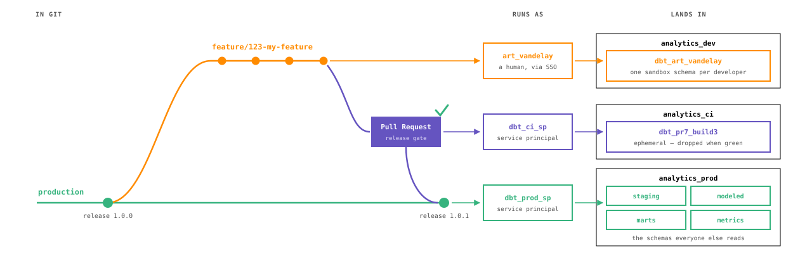

# dbt for Databricks — Why should you care?

## The Problem
Tired of this data engineering chaos?
- SQL spaghetti scattered across unversioned notebooks?
- Zero confidence because you can't test your data transformations?
- Endless copy-pasting leading to a fragile, unmaintainable mess?
- Undocumented data models that nobody understands?
- Manual, error-prone deployments slowing you down?

## The Solution: dbt
dbt is your secret weapon. It supercharges your Databricks workflows:
- **Leverages Databricks Compute, Saves Money**: dbt pushes all transformation logic directly into Databricks, efficiently using its parallel compute capabilities to reduce costs.
- **Version-Controlled & Modular SQL**: All your SQL lives in git. Build reusable, maintainable data models with macros and `ref()` functions.
- **Rich Ecosystem of Packages**: Tap into a vast library of pre-built dbt packages for data quality, transformations, migrations, and more, accelerating your development.
- **Testing & Validation**: Ensure your data meets expectations with built-in testing frameworks.
- **Automatic Documentation**: Generate comprehensive, up-to-date documentation for your entire data landscape.
- **CI/CD Ready**: Automate your deployments and move code seamlessly between environments.
- **Widely Adopted & Easy to Learn**: dbt is a popular, well-documented tool with a gentle learning curve. Plus, LLMs are surprisingly good at generating dbt code and answering your questions!

## What dbt is NOT
- dbt is NOT the same as dbt Cloud (the paid SaaS product)
  - `pip install dbt-databricks` and you're done
  - in fact, `dbt-databricks` is ENTIRELY built by DATABRICKS! Using `dbt-databricks` is like using `dbutils`, `databricks-sdk`, or `databricks-connect`
- dbt is NOT an ETL/ELT tool like Fivetran (it's the T in ELT)
- dbt is NOT a data warehouse or legacy ETL tool
  - dbt can not do compute. It must use Databricks to do any data processing.
- dbt is NOT taking compute away from Databricks - it USES Databricks compute

## What dbt IS

dbt is a command-line tool that:
1. Takes simple SQL select statements
2. Builds parellel deployments by default
3. Scams people into using version control, CICD, and testing
4. Manages your dev/test/prod/etc.. isolation automatically
5. Tests your data AND your transformations
6. Generates lineage documentation (and pushes it into databricks UC)

It's a complete workflow for managing data transformations in your warehouse.

It is the paved path that databricks users are desperate for.

---

# What this project builds: Databricks cost & usage analytics

This is a **reference implementation**. It models the Databricks **`system` catalog** —
specifically `system.billing.usage` and `system.billing.list_prices` — into cost-monitoring
and usage analytics.

Why the `system` catalog? Its schema is **identical on every Databricks workspace and every
cloud** (AWS / Azure / GCP), and the data updates continuously. That makes these models
portable: clone this project, point it at *your* workspace, and you get working cost analytics
out of the box.

```
sources   system.billing.usage   system.billing.list_prices
   │
   ▼
staging   stg_billing__usage     stg_billing__list_prices            (views: clean + rename)
   │
   ▼
modeled   int_usage_priced       (INCREMENTAL, record grain)         (join usage → effective price)
   │                              → list_cost = usage_quantity × effective_list_price
   ▼
marts     cost_daily             cost_by_workspace   cost_by_sku      (tables: analytics rollups)
          cost_by_product        cost_by_tag (showback)
```

**Key modeling choices**
- **Effective list price.** Cost uses `pricing.effective_list.default` (resolves list +
  promotional pricing) — the value Databricks documents for calculating cost.
- **Incremental fact.** `int_usage_priced` is `materialized: incremental` (merge on `record_id`).
  Incremental runs scan only recently-**ingested** usage: the 3-day lookback keys on
  `ingestion_date`, not `usage_date`, because corrections (`record_type` retraction /
  restatement) are new rows that carry the *original* usage date — sometimes weeks old —
  with a fresh ingestion date. A usage-date lookback would silently miss them. Full refresh
  is bounded by the `usage_history_days` var (default 90; pass a smaller value for quick demos).
- **`list_cost`, not "spend".** `list_prices` is the published list price; it does **not**
  include account-level discounts, so `list_cost` is a list-price estimate, not invoiced spend.
- **Account-level usage.** Some usage (storage, network, certain serverless features) has a
  NULL `workspace_id`; `cost_by_workspace` surfaces it as an explicit `(account-level)` bucket
  so it is attributed rather than silently dropped.
- **Currency-safe rollups.** Every mart carries `currency_code` in its grain — costs are
  never summed across currencies, so multi-currency accounts get correct numbers.
- **Tests prove correctness, not just success.** Beyond `not_null`/`unique`/`accepted_values`,
  every mart has a `dbt_utils.unique_combination_of_columns` test pinning its grain (a
  fan-out from a bad upstream join fails loudly), and two singular tests guard against the
  classic "green build, NULL costs" failure: `assert_recent_cost_is_positive` (a recent
  settled day must have positive cost) and `assert_dbu_usage_is_priced` (≤5% of recent DBU
  usage may be unpriced). In production, a source-freshness task runs *before* the build,
  so a stalled `system.billing` pipeline fails the run instead of staying green.

## Metric views: a governed semantic layer over the whole system catalog

`models/metric_views/` ships 24 **Unity Catalog metric views** covering the system
catalog's fact tables — billing usage, job/pipeline runs, query history, compute
timelines, audit/lineage events, serving and AI-gateway usage — ported from
[HobbsAnalytics/databricks-metric-views-system-tables](https://github.com/HobbsAnalytics/databricks-metric-views-system-tables),
where every join was SQL-validated N:1. Each model body IS the metric-view YAML
(dimensions + measures); dbt-databricks' `metric_view` materialization deploys it via
`CREATE VIEW ... WITH METRICS LANGUAGE YAML`, and `{{ source() }}` calls give every view
real lineage back to its `system.*` tables. Measures are queried with `MEASURE()`:

```sql
SELECT `Billing Origin Product`, MEASURE(`List Cost (USD)`) AS list_cost_usd
FROM <catalog>.<schema>.billing_usage_metrics
WHERE `Usage Date` >= current_date() - INTERVAL 7 DAYS
GROUP BY ALL ORDER BY list_cost_usd DESC;
```

The views read `system.*` sources directly on purpose (no staging hop): upstream
validated the joins against the raw system tables, and each view is self-contained —
point-in-time SCD windows are computed in inline join sources. Two of the 26 ported
views (`dq_monitoring_metrics`, `data_classification_metrics`) ship `enabled=false`
pending SELECT grants on their source tables.

**The system catalog can change under us — the tests are built to catch it.** These
models sit on 38 `system.*` tables Databricks evolves on its own schedule, so the suite
watches two failure classes:

- **Structure drift.** `seeds/system_table_schema_contract.csv` pins every system-table
  column the views were validated against. `assert_system_source_columns_match_contract`
  **fails** when a contracted column disappears or changes base type;
  `assert_system_source_full_types_match_contract` **warns** when a struct/map quietly
  gains fields (additive, usually benign — review it, then refresh the contract row).
  A view referencing a dropped column also fails loudly at `CREATE` time on every run.
- **Stale core assumptions.** The joins assert at-most-one match, so
  `dbt_expectations` tests pin the keys that make that true (`workspaces_latest`
  uniqueness — 22 joins ride on it — `node_types` and `list_prices` compound keys), and
  `assert_billing_usage_metrics_no_join_fanout` recomputes the raw fact count and compares
  it to `MEASURE(`Usage Records`)` over the same window: if ANY join starts fanning out,
  the numbers stop matching.

---

# Environments & schema routing — the "no `dbt init`" pattern

This project is configured so a brand-new contributor can clone it and run `dbt build` with
**zero configuration** — no `dbt init`, no copying a template, no secrets. The trick:

**1. Three project vars, each `env_var('X', '<dev fallback>')`** (see `dbt_project.yml`):

| var | env var | dev fallback |
|-----|---------|--------------|
| `deployment_environment` | `DBT_DEPLOYMENT_ENVIRONMENT` | `development` |
| `default_catalog` | `DBT_DEFAULT_CATALOG` | `analytics_dev` |
| `default_schema` | `DBT_DEFAULT_SCHEMA` | `dbt` |

The dev fallbacks live in source control (publicly visible) — in exchange, dev "just works".
Non-dev deployments inject the real values via environment variables.

**2. A committed `profiles.yml`** (yes, in the repo):
- `dev` target → **SSO OAuth (U2M)**. Stores **no secret**, so it is safe to commit. First run
  opens a browser for login (or reuses your `databricks auth login` session).
- `ci` / `prod` targets → **M2M OAuth**, every value read from env vars. Nothing sensitive on disk.
- **`host` and `http_path` have NO in-repo fallback** — they're workspace-specific and are internal
  infra identifiers we don't publish, so you must set `DBT_HOST` / `DBT_HTTP_PATH` (copy
  `template.env` → `.env`). `catalog` / `schema` keep dev fallbacks so schema routing stays zero-config.
- The M2M client secret uses the **`DBT_ENV_SECRET_`** prefix, so dbt masks it in logs and forbids
  it outside `profiles.yml` (it can never leak into compiled SQL or the warehouse).

**3. A `generate_schema_name` override** keyed on `deployment_environment`:

| environment | schema behavior |
|-------------|-----------------|
| `development` | Everything lands in ONE per-user schema: `{default_schema}_{username}` (e.g. `dbt_randy_pitcher`). Per-layer `+schema` configs are intentionally ignored, so your whole build stays in your personal sandbox and never collides with a teammate. The username comes from `DBT_DEV_USER` → OS `USER` → `dev_user`. |
| `ci_testing` | `default_schema` is used **unmodified**. CI sets `DBT_DEFAULT_SCHEMA` to a build-scoped name (e.g. `dbt_<project>_pr<pr>_build<run>`), giving every PR build a fully isolated, disposable namespace. |
| `production` | `default_schema` only when a model declares no custom schema; otherwise the model's `+schema` is used **unmodified** — so prod spreads across purpose-built namespaces (`staging`, `modeled`, `mart`, …). |

A matching `generate_database_name` override routes models to `default_catalog` the same way.

> Note: in `development` you will see staging/modeled/mart models all land in your single
> `dbt_<username>` schema. That is intentional — only prod splits per layer.

---

# Run it

### 1. Install dependencies (uv)

This project pins Python via `.python-version` (3.12). `uv.lock` is intentionally **not**
committed (see `.gitignore`): on Databricks-managed machines `uv` rewrites registry sources
to the internal PyPI proxy, which would be wrong for everyone else — so each clone resolves
against its own registry configuration.

The `Makefile` wraps the golden path (THE_ONE_TRUE_WAY #16) — every dbt command runs
via `uv run` inside the venv that `uv sync` builds from `pyproject.toml`, which carries
the project's EXACT dbt version pin:

```bash
cd databricks/demos/dbt
make deps               # = uv sync (venv from pyproject.toml) + uv run dbt deps (dbt packages)
```

### 2. Configure the connection + authenticate (dev = SSO, one time)

Set the two required connection vars (no in-repo fallback), then log in:

```bash
cp template.env .env           # then edit DBT_HOST + DBT_HTTP_PATH
                               # (dbt core 1.12+ auto-loads .env from this directory)

databricks auth login --profile DEFAULT     # opens a browser for SSO
```

`dbt` (with `auth_type: oauth`) reuses this session — no token stored in the repo.

### 3. Build

The committed `profiles.yml` lives in this directory and dbt picks it up from the
working directory automatically:

```bash
make build              # = uv run dbt build (dev target, full 90-day history)

# quick demo: only the last 14 days of usage
uv run dbt build --vars '{usage_history_days: 14}'
```

(`make run` and `make test` wrap `dbt run` / `dbt test` the same way.)

That creates your `dbt_<username>` schema and builds + tests the whole DAG. Then explore:

```sql
select * from <your_catalog>.dbt_<username>.cost_daily order by usage_date desc;
```

### 4. Docs & freshness (optional)

```bash
uv run dbt source freshness --target dev --profiles-dir .   # warns at 24h, errors at 48h
uv run dbt docs generate --target dev --profiles-dir . && uv run dbt docs serve
```

---

# Production DAB: state capture + hosted docs

This demo also includes a Databricks Asset Bundle (`databricks.yml`) for production operations:

- A managed Unity Catalog volume for production dbt artifacts.
- A daily serverless workflow job that checks source freshness, runs `dbt build -s tag:daily`,
  captures the production state artifacts, and regenerates dbt docs.
- A Databricks app that serves the generated dbt docs from the volume.

Every job runs as a **dedicated service principal** (`run_as` per job in the prod target),
never the deploying human, and the bundle deploys under the production SP's own workspace
folder so production isn't coupled to anyone's home directory. There are two SPs, looked up
by display name:

- **`dbt_prod_sp`** runs CD/Daily/Hourly and owns everything durable: it needs SELECT on
  `system.billing`, ownership-level access to the production catalog/schemas, and WRITE on
  the artifacts volume.
- **`dbt_ci_sp`** runs CI and nothing else: it owns the CI catalog the disposable per-PR
  schemas land in, and on the production catalog it holds **read-only** grants (USE CATALOG,
  USE SCHEMA, SELECT, READ VOLUME — enough for Slim CI deferral and the state download), so
  a CI run of unreviewed PR code cannot write to production by accident.

The deploying identity needs CAN_USE on both SPs — including `dbt_prod_sp` itself, since the
CD job redeploys this bundle as the production SP and must set the CI job's `run_as`. Both
SPs also need CAN_USE on the `dbt_wh` SQL warehouse (dbt's first connection fails with
PERMISSION_DENIED on the SQL endpoint otherwise).

Production runs also apply **grants as code**: every `dbt build` grants `SELECT` on the marts
to `account users` (see `+grants` in `dbt_project.yml`) — consumers get access as part of the
run, not via manual GRANT statements.

Default production artifact paths:

```text
/Volumes/rpw_prod/dbt_artifacts/dbt_demo_artifacts/state/latest
/Volumes/rpw_prod/dbt_artifacts/dbt_demo_artifacts/docs/latest
```

Deploy and run:

```bash
databricks bundle validate -t prod
databricks bundle deploy -t prod
databricks bundle run dbt_production_daily -t prod
databricks bundle run dbt_docs -t prod
```

The bundle looks up a SQL warehouse named `dbt_wh` and service principals named `dbt_prod_sp`
and `dbt_ci_sp` by default. Override any of them when deploying if your workspace uses
different names:

```bash
databricks bundle deploy -t prod \
  --var="warehouse_id=<warehouse-id>" \
  --var="production_service_principal=<sp-application-id>" \
  --var="ci_service_principal=<sp-application-id>"
```

The docs app derives its `/Volumes/<catalog>/<schema>/<volume>` path from the same
`production_catalog`, `production_artifact_schema`, and `production_artifact_volume` bundle variables
that the job uses. You can also set `DBT_ARTIFACT_VOLUME_FULL_NAME` to `catalog.schema.volume` for a
single injected value.

---

# CI/CD

The whole lifecycle in one view — what each git state is, which service principal it runs
as, and which catalog it lands in:



CI is **live**: [`.github/workflows/dbt-ci.yml`](../../../.github/workflows/dbt-ci.yml)
builds and tests every PR that touches this project, into its own disposable schema:

```bash
DBT_DEPLOYMENT_ENVIRONMENT=ci_testing
DBT_DEFAULT_CATALOG=rpw_ci   # the CI catalog -- production is read-only to CI
DBT_DEFAULT_SCHEMA=dbt_rpw_dbt_databricks_reference_pr${PR_NUMBER}_build${RUN_NUMBER}
```

Because the schema name carries the PR number **and** the build number, a re-run after a fix
builds fully isolated from the previous attempt.

**Where it runs.** GitHub is only the gate and the trigger — dbt executes in the
`dbt CI` **Databricks job** ([`resources/dbt_ci.job.yml`](resources/dbt_ci.job.yml)):
defined, unscheduled, parameterized, serverless. The workflow passes job parameters
(`git_ref` = PR head SHA, `ci_schema`) and polls the run. Why a job instead of
running dbt on the runner:

* **centralized logs** — every dbt run (CI and prod) lives in the Jobs UI;
* **uv pins dbt** — the tasks run `dbt` via `uv sync` from `pyproject.toml`
  ([`scripts/databricks_dbt_runner.py`](scripts/databricks_dbt_runner.py)), so a dbt
  upgrade is a one-line PR, never a job edit (no managed `dbt_task` type anywhere);
* **`--fail-fast`** — CI builds stop at the first failure;
* **one committed `profiles.yml`** — dev/ci/prod all resolve from the same file with
  env-var placeholders; no platform-generated profile to drift from it.

**Auth: `run_as` is the whole setup.** Each job runs as a dedicated service principal —
CI as `dbt_ci_sp` (owner of the CI catalog, read-only on production), everything else as
`dbt_prod_sp` — and the task wrapper resolves a short-lived token from its ambient
runtime credentials. No OAuth client secret is provisioned, stored, or rotated anywhere —
and the GitHub side holds zero Databricks secrets either (the trigger runs on a
self-hosted runner inside a Databricks App —
[`databricks/apps/github-actions-runner-spike/`](../../apps/github-actions-runner-spike/) —
because the workspace's IP access lists block even the Jobs API from GitHub-hosted
runners; the runner app's SP has CAN_MANAGE_RUN on the CI + CD jobs and nothing else).

Because this is a public repo, PR code **never executes on the runner** — the job
downloads the repo tarball at the PR head SHA and runs it on serverless compute — and the
workflow refuses to schedule for fork PRs (job-level head-repo + actor guards); see the
workflow header for the full security model.

**Slim CI.** The production jobs capture dbt state (`manifest.json`) to the artifacts volume,
and CI downloads it to build **only changed models and their descendants**
(`dbt build -s state:modified+ --defer --state prod_state`), deferring unmodified parents to
the production relations. If the state download fails (first run, missing permissions), CI
falls back to a full build.

**Continuous deployment.** On merge to `main`,
[`.github/workflows/dbt-cd.yml`](../../../.github/workflows/dbt-cd.yml) fires **only when
this directory changed** and triggers the `dbt CD` job
([`resources/dbt_cd.job.yml`](resources/dbt_cd.job.yml)), which does both halves of a
deploy in one run: `databricks bundle deploy -t prod` at the merged SHA (the DAB
components — jobs, schema, volume, docs app — redeploy themselves, as the production SP),
then a slim production build (`dbt build -s state:modified+ --fail-fast`) and a state
refresh. No deployer identity or credential exists outside the job's `run_as`.

**The job surface is static** (THE_ONE_TRUE_WAY #15): `dbt CI`, `dbt CD`, `dbt Daily`,
and `dbt Hourly`. Scheduled jobs select by cadence tag (`tag:daily`, `tag:hourly`), so
moving a model between cadences — or adding the first `tag:hourly` model ever — is a
one-line `+tags` change in the dbt project; the job definitions never change. (`dbt
Hourly` ships paused until the first hourly model lands, so no-op runs don't burn
serverless minutes.)

**Hygiene.** Every CI run is one flow: `dbt build --fail-fast` followed — **only after a
green build** — by the [`ci_cleanup`](macros/operations/ci_cleanup.sql) run-operation with
`dry_run: False`, which drops this build's schema **and** sweeps stale CI schemas leaked
by earlier failed or cancelled runs. A failed build deliberately leaves its schema up for
debugging; the next green run reclaims it. Per the house rule (THE_ONE_TRUE_WAY #13),
`ci_cleanup`'s final argument is `dry_run` defaulting to `true`, printing exactly what a
live run would execute:

```bash
# see what cleanup WOULD do (default: dry run)
uv run dbt run-operation ci_cleanup \
  --args '{schema: dbt_rpw_dbt_databricks_reference_pr42_build3}' \
  --target ci --profiles-dir .

# actually do it (what CI runs after a green build)
uv run dbt run-operation ci_cleanup \
  --args '{schema: dbt_rpw_dbt_databricks_reference_pr42_build3, dry_run: False}' \
  --target ci --profiles-dir .
```

---

# Reference

- dbt `profiles.yml`: https://docs.getdbt.com/docs/core/connect-data-platform/profiles.yml
- Databricks setup for dbt: https://docs.getdbt.com/docs/core/connect-data-platform/databricks-setup
- Databricks billing system tables: https://docs.databricks.com/admin/system-tables/billing.html
