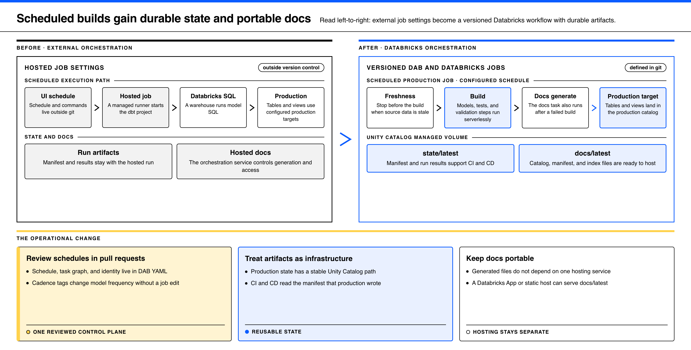
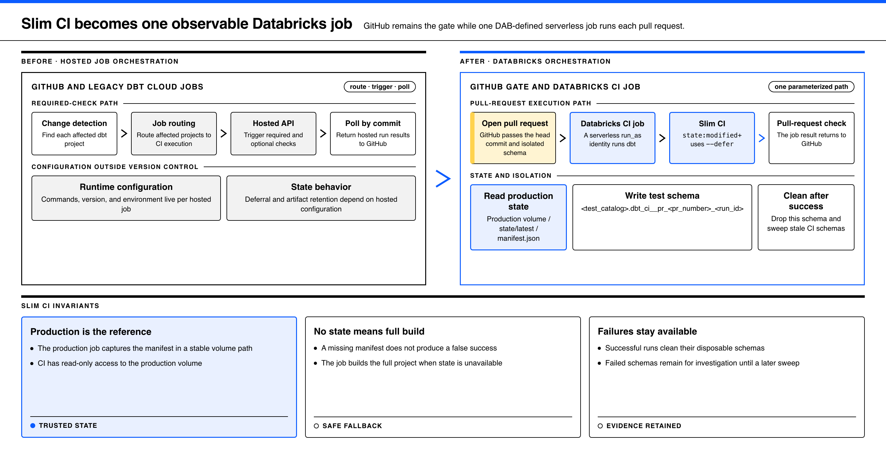
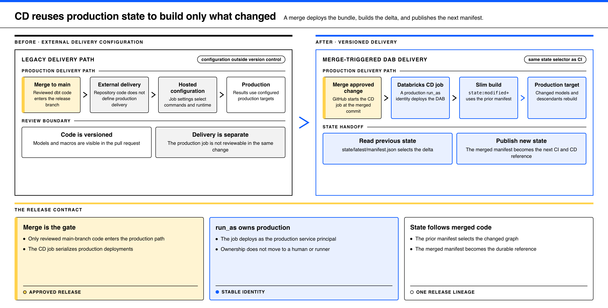
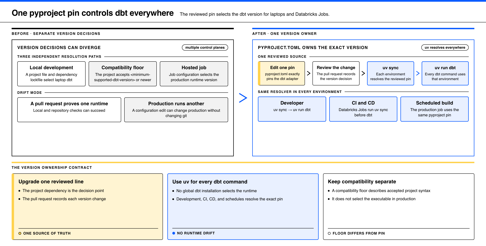

# Move dbt orchestration to Databricks

This guide shows how to move dbt orchestration into version-controlled Databricks Asset Bundles and Jobs.

Use the four changes in order. Each change creates a stable input for the next change.

## 1. Move scheduled builds into a DAB



Source: [`diagrams/scheduled-builds-migration.html`](diagrams/scheduled-builds-migration.html).
Regenerate it with the `diagram` skill. The render command is in the file header.

Define the schedule, task graph, and execution identity in the DAB. Run the job with
serverless compute and a production service principal through `run_as`.

Store these production artifacts in a managed Unity Catalog volume:

- `manifest.json` provides state for later CI and CD runs.
- `run_results.json` records the result of the production build.
- Generated catalog, manifest, and index files support portable dbt docs hosting.

The docs files do not depend on one hosting service. This project serves them through a
Databricks App, but another static host can serve the same files.

## 2. Replace hosted CI jobs with one Databricks job



Source: [`diagrams/slim-ci-migration.html`](diagrams/slim-ci-migration.html).
Regenerate it with the `diagram` skill. The render command is in the file header.

Keep GitHub as the pull-request gate. Pass the head commit and the test schema to one
parameterized Databricks job.

The job reads the production manifest and runs:

```bash
uv run dbt build -s state:modified+ --defer --state prod_state --fail-fast
```

Build the full project when the production manifest is absent or unreadable. This fallback
prevents a missing state file from producing a false success.

Give each run a schema such as
`<test_catalog>.dbt_ci__pr_<pr_number>_<run_id>`. Clean the schema after a successful run.
Keep failed schemas temporarily for investigation, then remove them during a later cleanup.

The CI service principal must have read-only access to the production state and relations.
It must have write access only to the CI catalog.

## 3. Use the same state for continuous delivery



Source: [`diagrams/state-based-cd-migration.html`](diagrams/state-based-cd-migration.html).
Regenerate it with the `diagram` skill. The render command is in the file header.

Trigger one Databricks CD job after a reviewed change enters the production branch. The job
deploys the production DAB with its production `run_as` identity.

Next, run `state:modified+` against the previous production manifest. Build the full project
when no previous manifest exists.

Write the merged manifest to the stable production state path. The new manifest becomes the
reference for the next CI or CD run.

## 4. Give uv ownership of the dbt version



Source: [`diagrams/dbt-version-ownership-migration.html`](diagrams/dbt-version-ownership-migration.html).
Regenerate it with the `diagram` skill. The render command is in the file header.

Pin the dbt adapter exactly in `pyproject.toml`. Run `uv sync` before each dbt command in
development and in every Databricks job.

Run dbt through `uv run dbt`. Do not use a global dbt installation as an implicit version
source.

This project pins `dbt-databricks==1.12.4`. A version upgrade changes one reviewed line, and
the same pin controls development, CI, CD, and scheduled production jobs.

## Result

The repository now owns the schedule, job graph, identities, state paths, delivery path, and
dbt version. The Unity Catalog volume connects scheduled builds, Slim CI, state-based CD, and
portable docs hosting.

See [`../THE_ONE_TRUE_WAY.md`](../THE_ONE_TRUE_WAY.md) for the complete operating model. See
[`../README.md`](../README.md) for the reference implementation and run commands.
