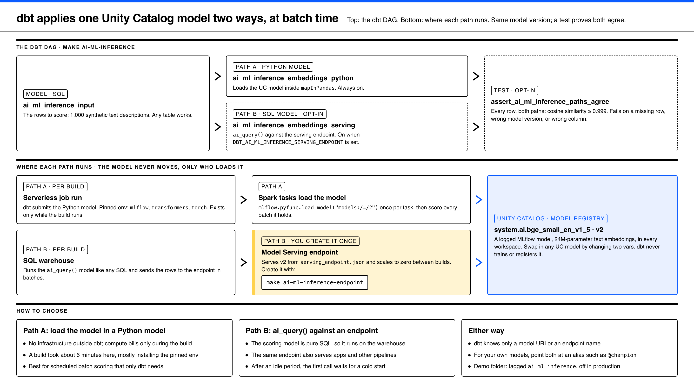

# AI/ML inference: apply a Unity Catalog model from dbt, at batch time



Source: [`docs/diagrams/ai-ml-inference.html`](../../docs/diagrams/ai-ml-inference.html).
Regenerate it with the `diagram` skill. The render command is in the file header.

This folder shows one thing: **how dbt applies a model that is already logged
in Unity Catalog** to a table, in batch. dbt does not train, log, register, or
promote models. That lifecycle belongs to MLflow and happens outside this repo.
dbt only knows a model URI or an endpoint name.

```bash
make ai-ml-inference              # path A (always), path B + agreement test (when enabled)
make ai-ml-inference-endpoint     # once: create YOUR endpoint for path B
```

## The model

`system.ai.bge_small_en_v1_5`, version 2: a small (24M-parameter) text
embedding model that Databricks logs in Unity Catalog in every workspace. No
setup, no training, no registration. It stands in for **your** model: any
MLflow model logged in Unity Catalog works the same way. Change two vars:

| var | env var | default |
| --- | --- | --- |
| `ai_ml_inference_model_name` | `DBT_AI_ML_INFERENCE_MODEL_NAME` | `system.ai.bge_small_en_v1_5` |
| `ai_ml_inference_model_version` | `DBT_AI_ML_INFERENCE_MODEL_VERSION` | `2` |

Version 2, not the newer 3: version 3's logged requirements pin
`transformers==4.44.0.dev0`, which is not on PyPI, so Model Serving cannot
build a container for it. Check a model's `requirements.txt` before you serve
it.

## The DAG

```
ai_ml_inference_input                 the rows to score (1,000 synthetic texts)
  ├─ ai_ml_inference_embeddings_python    path A: Python model loads the UC model
  └─ ai_ml_inference_embeddings_serving   path B: ai_query() -> serving endpoint   [opt-in]
        └─ assert_ai_ml_inference_paths_agree   both paths, every row, cosine >= 0.999   [opt-in]
```

## Two paths

| | Path A: Python model | Path B: `ai_query()` + serving endpoint |
| --- | --- | --- |
| Model | `ai_ml_inference_embeddings_python.py` | `ai_ml_inference_embeddings_serving.sql` |
| dbt knows | the model URI, `models:/<name>/<version>` | the endpoint name |
| Runs on | the Python model's serverless job run | the SQL warehouse, which calls the endpoint |
| Infra outside dbt | none | one endpoint, from `serving_endpoint.json` |
| Idle cost | none | none (scale to zero); a cold start after idle |
| Pick it when | only this pipeline needs the scores | apps and other pipelines share the model, or scoring must be pure SQL |

### Path A: load the model in a dbt Python model

dbt submits the Python model as a serverless job run. `mapInPandas` gives each
Spark task an iterator of pandas batches. Each task loads the model once with
`mlflow.pyfunc.load_model("models:/<name>/<version>")`, then scores every
batch it holds. The compute exists only while the build runs.

- **Pin the environment.** `environment_dependencies` must be able to load the
  model's flavor. Here that is `mlflow`, `transformers`, and `torch`. A build
  took about 6 minutes, mostly for that install.
- **Why not `mlflow.pyfunc.spark_udf`?** It expects one output value per input
  row. This model, like many LLM-style pyfuncs, returns one OpenAI-style object
  per batch: `{"data": [{"index": i, "embedding": [...]}]}`. `mapInPandas`
  does the same job and makes the unpacking explicit. For a model that returns
  one value per row (most scikit-learn, XGBoost, or tabular models),
  `spark_udf` is the shorter option.
- **Set both MLflow URIs.** MLflow 3 otherwise defaults the tracking store to a
  local SQLite file, and the load fails on the workers.

### Path B: `ai_query()` against a serving endpoint

A Model Serving endpoint serves the same UC model version. The dbt model is
plain SQL: `ai_query('<endpoint>', input_text)`. It runs on the warehouse,
which sends the rows to the endpoint in batches.

```bash
make ai-ml-inference-endpoint
# creates ai-ml-inference-<you> from serving_endpoint.json and waits for READY
# (a first deploy builds the model's container: 15+ minutes)

echo 'DBT_AI_ML_INFERENCE_SERVING_ENDPOINT=ai-ml-inference-<you>' >> .env
make ai-ml-inference    # now builds path B and the agreement test too
```

The target is safe to re-run: it changes the endpoint only when the model name
or version in `serving_endpoint.json` differs from what the endpoint serves.
`tests/test_patterns.py` checks that the JSON and the dbt vars name the same
model version.

### The agreement test

`assert_ai_ml_inference_paths_agree` joins both outputs on `input_id` and
fails any row where the cosine similarity is below 0.999, or where a row is
missing from one side. It uses similarity rather than equality because the
endpoint's container and the Python model's environment use different library
versions. A real mistake, such as another model version, the wrong input
column, or rows out of order, scores far below the threshold.

## Out of production

The folder is tagged `ai_ml_inference`, never `daily`, and is **disabled when
`deployment_environment` is `production`**. The CD job builds every modified
node in production, so a tag alone would not keep it out. `tests/test_patterns.py`
checks both.
