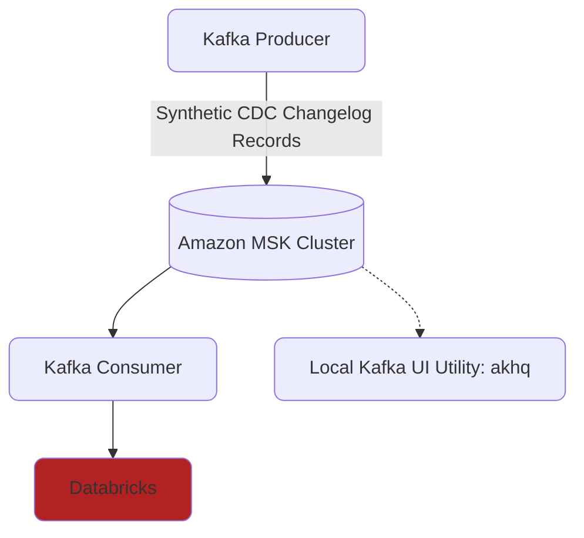

# Kafka CDC Simulation

A lightweight, end-to-end playground for streaming **Change-Data-Capture (CDC)** records through an Amazon MSK (Kafka) cluster and landing them in Databricks with Delta Live Tables (DLT).

---

---

## What it does (in one breath)
1. **Generate** realistic CDC changelogs like those one would expect from Debezium or AWS DMS.
2. **Stream** those events into an Amazon MSK Kafka topic secured with SCRAM/IAM.
3. **Consume & merge** the stream with SQL DLT pipelines, producing a clean up-to-date table.
4. **Observe** everything with the AKHQ web UI and Databricks Dasbhoarding.

## Folder guide
- `kafka/` – Terraform & client configs for spinning up the MSK cluster and bastion host.
- `kafka_producers/`
  • different producer approaches to generating cdc records
- `kafka_consumers/`
  • different consumer approaches to ingesting and processing cdc records
- `utils/`
  • `akhq/` - Local dev UI for Kafka
  • `sync_env_vars.py` – Push local `.env` secrets to a Databricks scope.
- `cursor/` – Internal project notes useful for quickly getting your vibecode tooling up to speed with how this project works.

---
Happy streaming! 🚀
