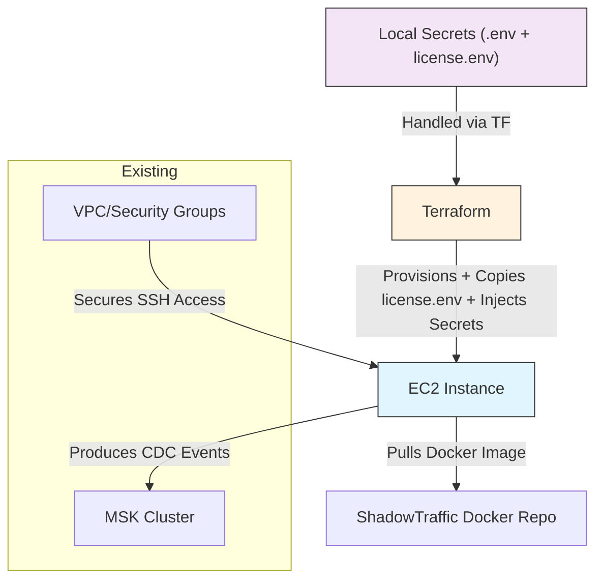

# ShadowTraffic EC2 Deployment Plan

This document outlines a simplified plan for deploying ShadowTraffic to an AWS EC2 instance using Terraform. It builds upon the existing MSK deployment in this project, with simplifications based on feedback.

## Simplifications Made
- **Hardcoded Networking**: Using the same VPC and subnets as the MSK Terraform (default VPC, subnets: subnet-07480b8fbbb9501bd and subnet-0a04badfd09d050b0).
- **Secrets Handling**: Copy `license.env` to EC2 via file provisioner (not stored in git). Use Terraform sensitive variables for `.env` secrets (username, password, brokers). Interpolate into remote-exec docker run.
- **SSH Key**: Reuse the existing `msk-bastion-key` from MSK bastion.
- **Security Group**: Wide open for SSH using two /1 CIDRs (0.0.0.0/1 and 128.0.0.0/1) to represent all IPs without using restricted 0.0.0.0/0.
- **Startup**: Install Docker via user data. Use remote-exec to run docker with --env-file for license.env, injected vars, and --restart=unless-stopped for auto-restart.

**Note**: Only license.env is copied (ephemerally during apply); other secrets are passed via TF vars. Container auto-restarts on crash/exit unless explicitly stopped.

## Project Review Summary

After reviewing the `cursor/` and `shadowtraffic/` folders:

### Cursor Folder Insights
- Contains documentation on MSK cluster deployment using Terraform.
- Key files:
  - `2025-08-04-msk-deployment-summary.md`: Details successful MSK deployment with public access, SCRAM authentication, and ACLs.
  - `msk-authentication.md`: Guides on authenticating to MSK using SCRAM credentials stored in AWS Secrets Manager.
  - `msk-terraform-vs-aws.md`: Compares Terraform-managed resources vs. manual steps, including networking, security, and deployment playbook.

The MSK cluster is set up in us-east-1 with public brokers, ready for producers like ShadowTraffic.

### ShadowTraffic Folder Insights
- Contains configuration for simulating CDC events to Kafka.
- Key files:
  - `cdc_generator.json`: ShadowTraffic generator config with two-stage execution (initial inserts + ongoing CDC).
  - `license.env`: Sensitive license file (never commit to git).
  - `shadowtraffic-cdc-configuration.md`: Explains the config, environment variables, and Docker run command for local execution.

Currently, ShadowTraffic runs locally via Docker, producing CDC events to the MSK topic with env vars for brokers, auth, etc. It generates ~2.5M records every 3 hours after initial load.

The deployment will move this to a reliable EC2 instance for continuous production.

## Deployment Goals
- Provision a dedicated EC2 instance for running ShadowTraffic in Docker.
- Use Terraform to manage infrastructure, extending existing MSK setup.
- Secure SSH access with reused key and wide-open (but policy-compliant) security group.
- Automate Docker startup with hybrid secrets handling and auto-restart.
- Minimize costs with t3.2xlarge instance (32GB RAM, burstable performance).

## High-Level Architecture



- **EC2 Instance**: Runs ShadowTraffic Docker container continuously with auto-restart.
- **Integration**: Uses public MSK brokers from TF vars.
- **Security**: Reused SSH key; security group allows SSH from all (via /1 CIDRs); outbound all for MSK and Docker. license.env copied but can be deleted post-deploy.

## Terraform Resources Needed

Extend `kafka/terraform-msk-instance/` or create a new module with these resources. Key changes: File provisioner for license.env, --env-file and --restart in docker run.

1. **EC2 Instance** (`aws_instance`):
   - AMI: Latest Amazon Linux 2.
   - Instance Type: t3.2xlarge (8 vCPU, 32GB RAM - cheapest burstable option for 32GB).
   - Subnet: Hardcoded public subnet (e.g., subnet-07480b8fbbb9501bd).
   - Key Name: `msk-bastion-key` (reused).
   - User Data: Install Docker.
   - Provisioners: File (for cdc_generator.json and license.env), remote-exec (run docker with --env-file, injected secrets, and auto-restart).

2. **Security Group** (`aws_security_group`):
   - Inbound: SSH (22) from 0.0.0.0/1 and 128.0.0.0/1.
   - Outbound: All traffic.

3. **Sensitive Variables** (in variables.tf):
   - For `.env`: `username`, `password`, `kafka_brokers`.

Sample Terraform snippet (add to existing main.tf or new file; add vars to variables.tf):

```terraform
# In variables.tf
variable "username" { sensitive = true }
variable "password" { sensitive = true }
variable "kafka_brokers" { sensitive = true }

# Hardcoded values from MSK setup
variable "vpc_id" { default = "vpc-0f3f3f3f3f3f3f3f" }  # Replace with actual default VPC ID if needed
variable "subnets" { default = ["subnet-07480b8fbbb9501bd", "subnet-0a04badfd09d050b0"] }

resource "aws_security_group" "shadowtraffic_sg" {
  name        = "shadowtraffic_sg"
  description = "Allow SSH from all"
  vpc_id      = var.vpc_id

  ingress {
    from_port   = 22
    to_port     = 22
    protocol    = "tcp"
    cidr_blocks = ["0.0.0.0/1", "128.0.0.0/1"]
  }

  egress {
    from_port   = 0
    to_port     = 0
    protocol    = "-1"
    cidr_blocks = ["0.0.0.0/0"]
  }
}

resource "aws_instance" "shadowtraffic_producer" {
  ami           = data.aws_ami.amazon_linux.id
  instance_type = "t3.2xlarge"
  subnet_id     = var.subnets[0]  # Use first public subnet
  key_name      = "msk-bastion-key"  # Reused from MSK bastion

  vpc_security_group_ids = [aws_security_group.shadowtraffic_sg.id]

  user_data = <<-EOF
    #!/bin/bash
    yum update -y
    amazon-linux-extras install docker -y
    systemctl start docker
    systemctl enable docker
    usermod -a -G docker ec2-user
  EOF

  tags = {
    Name = "shadowtraffic-cdc-producer"
  }

  # Copy non-sensitive config and license.env
  provisioner "file" {
    source      = "/Users/randy.pitcher/projects/shareables/databricks/kafka_cdc_simulation/kafka_producers/shadowtraffic/cdc_generator.json"
    destination = "/home/ec2-user/cdc_generator.json"
  }

  provisioner "file" {
    source      = "/Users/randy.pitcher/projects/shareables/databricks/kafka_cdc_simulation/kafka_producers/shadowtraffic/license.env"
    destination = "/home/ec2-user/license.env"
  }

  # Run docker with env-file, injected secrets, and auto-restart
  provisioner "remote-exec" {
    inline = [
      "docker run -d --name shadowtraffic --restart=unless-stopped \\",
      "  --env-file /home/ec2-user/license.env \\",
      "  -e KAFKA_TOPIC='dev_sturdy_chair' \\",
      "  -e KAFKA_BROKERS='${var.kafka_brokers}' \\",
      "  -e KAFKA_SASL_JAAS_CONFIG='org.apache.kafka.common.security.scram.ScramLoginModule required username=\"${var.username}\" password=\"${var.password}\";' \\",
      "  -e RUN_STARTED_AT=\"$(date '+%Y-%m-%d %H:%M:%S')\" \\",
      "  -e PAYLOAD_STRING=\"$(printf '🪐%.0s' {1..7680})\" \\",  # 30KB (7680 * 4 bytes)
      "  -v /home/ec2-user/cdc_generator.json:/home/config.json \\",
      "  shadowtraffic/shadowtraffic:latest \\",
      "  --config /home/config.json"
    ]
  }

  connection {
    type        = "ssh"
    user        = "ec2-user"
    private_key = file("~/.ssh/msk-bastion-key.pem")  # Local path to private key
    host        = self.public_ip
  }
}

# Data source for AMI
data "aws_ami" "amazon_linux" {
  most_recent = true
  owners      = ["amazon"]
  filter {
    name   = "name"
    values = ["amzn2-ami-hvm-*-x86_64-gp2"]
  }
}
```

**Notes**:
- **license.env**: Copied during apply; not in git/TF state. Can manually delete after via SSH if desired.
- **Auto-Restart**: --restart=unless-stopped ensures container restarts on crash/exit (unless stopped with docker stop).
- **Alternative: Docker Compose**: For more robust management, add user_data to install docker-compose, copy a docker-compose.yml, and run `docker-compose up -d` in remote-exec. This allows restart: always in YAML.
- **PAYLOAD_STRING**: Set to 7680 🪐 (30KB assuming 4 bytes/char for 🪐, 1024 bites / kb; adjust count if needed).
- **Sensitive Vars**: Prompted during apply or set via TF_VAR_*.
- **VPC ID**: Confirm and hardcode the actual default VPC ID.
- **Instance Type**: t3.2xlarge provides 32GB RAM at ~$0.33/hour (us-east-1); burstable, so monitor CPU credits if sustained load is high. Switch to m5.2xlarge (~$0.384/hour) if needing consistent performance.

## Deployment Steps

1. **Prepare Terraform**:
   - Add the code to `kafka/terraform-msk-instance/main.tf` (or new) and variables.tf for sensitive vars.
   - Ensure `~/.ssh/msk-bastion-key.pem` exists locally.

2. **Apply Terraform**:
   - Use this bash command to source .env and auto-inject vars (assumes .env in project root; license.env is copied directly):
     ```bash
     source /Users/randy.pitcher/projects/shareables/databricks/kafka_cdc_simulation/.env
     export TF_VAR_username="$USERNAME"
     export TF_VAR_password="$PASSWORD"
     export TF_VAR_kafka_brokers="$KAFKA_BROKERS"
     terraform init && terraform apply -auto-approve
     ```
   - This sources vars, sets TF_VAR_* for injection, and applies without prompts.

3. **Validate**:
   - SSH to instance: `ssh -i ~/.ssh/msk-bastion-key.pem ec2-user@<public_ip>`
   - Check Docker: `docker ps` and `docker logs shadowtraffic`

4. **Teardown**:
   - `terraform destroy`

## Potential Challenges & Mitigations
- **Secret Handling**: license.env copied at runtime; delete manually if concerned (e.g., add to remote-exec: rm /home/ec2-user/license.env after start).
- **Provisioner Failures**: If SSH issues, fall back to manual SSH: copy files and run docker command.
- **Costs/Security**: t3.2xlarge ~$0.33/hour; wide SSH open but you can tighten CIDRs later.
- **Updates**: For config changes, re-run the bash command (sources fresh vars).

This final version balances security, automation, and reliability—ready to deploy! 