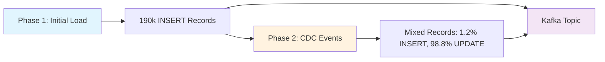

# ShadowTraffic CDC Configuration

> ⚠️ **LICENSE REQUIREMENT**: This configuration requires a valid ShadowTraffic license file named `license.env` in the `shadowtraffic` folder. **Never commit this file to git** as it contains sensitive license information.

> 📚 **Documentation**: For detailed ShadowTraffic configuration options, see the [ShadowTraffic Documentation](https://docs.shadowtraffic.io/).

## Overview

This configuration simulates Change Data Capture (CDC) events using a single generator with two-phase execution. It creates realistic database change patterns by first loading initial data, then continuously generating mixed INSERT/UPDATE events.

## High-Level Architecture



## Two-Stage Generator Execution

### Stage 1: Unbounded High-Throughput Inserts
- **Duration**: ~38 seconds
- **Records**: Exactly 190,000 INSERT records
- **Throughput**: 5,000 events/second
- **Purpose**: Populate the generator's internal history with record IDs

### Stage 2: Rate-Controlled Mixed Events
- **Duration**: Continuous
- **Throughput**: 231 events/second (2.5M records/3 hours)
- **Mix**: 1.2% INSERT, 98.8% UPDATE
- **Key Feature**: UPDATE events retrieve actual IDs from Stage 1 at random

## ID Lookup Mechanism

UPDATE events use ShadowTraffic's `lookup` function to randomly select record IDs that were actually generated during the initial load:

```json
{
  "record_type": "UPDATE",
  "record_id": { 
    "_gen": "lookup", 
    "name": "cdc_events", 
    "path": ["value", "record_id"], 
    "strategy": "random" 
  }
}
```

This ensures realistic CDC patterns where updates reference existing records.

## Environment Variables

| Variable | Purpose | Example |
|----------|---------|---------|
| `KAFKA_TOPIC` | Target Kafka topic | `rpw_cdc_simulation__sad_lightning` |
| `KAFKA_BROKERS` | MSK broker endpoints | `<PUBLIC_SCRAM_BROKERS>` |
| `KAFKA_SASL_JAAS_CONFIG` | Authentication config | `org.apache.kafka.common.security.scram.ScramLoginModule required username="..." password="...";` |
| `RUN_STARTED_AT` | Timestamp for run tracking | `2025-01-14 10:30:00` |
| `PAYLOAD_STRING` | Custom payload data | `sample_payload_data` |

## Performance Characteristics

- **Stage 1**: 190k records in ~38 seconds at 5,000 events/second
- **Stage 2**: 231 events/second sustained rate
  - INSERT Events: 2.8 events/second (30k per 3 hours)
  - UPDATE Events: 228.2 events/second (2.47M per 3 hours)
- **Total Volume**: 2.5 million records every 3 hours

## Usage

```bash
# Navigate to the ShadowTraffic configuration directory
cd databricks/kafka_cdc_simulation/kafka_producers/shadowtraffic

# Run ShadowTraffic with CDC configuration
docker run --rm --env-file ./license.env \
  -e KAFKA_TOPIC="rpw_cdc_simulation__sad_lightning" \
  -e KAFKA_BROKERS="..." \
  -e KAFKA_SASL_JAAS_CONFIG="..." \
  -e RUN_STARTED_AT="$(date '+%Y-%m-%d %H:%M:%S')" \
  -e PAYLOAD_STRING="sample_payload_data" \
  -v $(pwd)/cdc_generator.json:/home/config.json \
  shadowtraffic/shadowtraffic:latest \
  --config /home/config.json
```

## Key Benefits

1. **Realistic CDC Patterns**: Sequential INSERT then mixed INSERT/UPDATE
2. **Internal ID Resolution**: UPDATE events reference actual INSERT record IDs
3. **High Performance**: Optimized for maximum throughput
4. **Proven Stability**: Extended runtime testing confirms reliability 