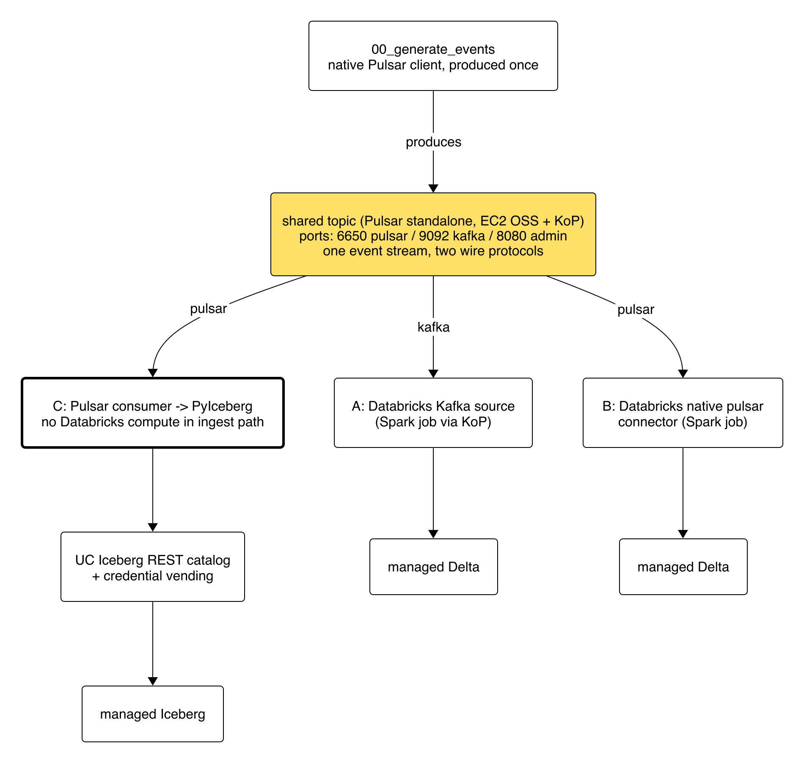
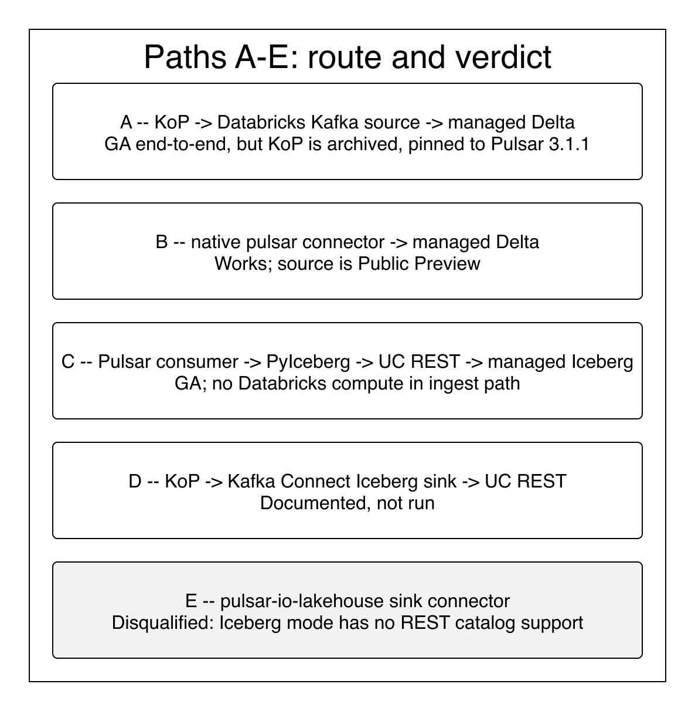

# 🌊 Pulsar → Unity Catalog Managed Tables

**The question:** what are the best ways to get events out of Apache Pulsar and into
Unity Catalog **managed** tables (Delta or Iceberg both acceptable)?

This is a live evaluation, not a thought exercise: a real Pulsar broker (with the
Kafka-on-Pulsar protocol handler), one synthetic event stream, and every viable path
run end-to-end into real managed tables. Results land in
[`results/matrix_results.json`](results/matrix_results.json); background research in
[`docs/research/connector-landscape.md`](docs/research/connector-landscape.md).


*One synthetic event stream, produced once, drained over both the Pulsar and Kafka wire protocols into managed Delta and managed Iceberg.*

```
                          ┌──────────────────────────────────────────────┐
                          │  Pulsar standalone (EC2, OSS image + KoP)    │
  00_generate_events ───► │  one topic, two protocols: 6650 (pulsar),    │
                          │  9092 (kafka)                                │
                          └───────┬──────────────┬──────────────┬────────┘
                                  │ kafka        │ pulsar       │ pulsar
                                  ▼              ▼              ▼
                          A: Databricks     B: Databricks   C: PyIceberg via
                          Kafka source      native pulsar   UC Iceberg REST +
                          (GA)              source (preview) credential vending (GA)
                                  │              │              │
                                  ▼              ▼              ▼
                          managed Delta     managed Delta   managed Iceberg
```

## The paths


*Path-by-path verdicts at a glance; details in the table below.*

| Path | Route | Table | Databricks compute in ingest path? | GA status | Verdict |
|---|---|---|---|---|---|
| **A** | KoP (Kafka protocol) → Structured Streaming Kafka source | managed Delta | yes | **GA end-to-end** | ✅ works — 100k rows, 27.3s drain (~3.7k rows/s). Caveat: KoP is archived (see findings) |
| **B** | native `format("pulsar")` connector (DBR 14.1+) | managed Delta | yes | source is **Public Preview, no GA timeline** | ✅ works — 100k rows, 20.3s drain (~4.9k rows/s), fastest and simplest — but see GA note below |
| **C** | Pulsar consumer → PyIceberg → UC Iceberg REST catalog | managed Iceberg | no | **GA** (managed Iceberg + credential vending) | ✅ works — 100k rows in 20 commits, 114.4s (~874 rows/s), no Databricks compute |
| **D** | KoP → Kafka Connect Iceberg sink → UC Iceberg REST | managed Iceberg | no | GA surface, needs a Connect worker | documented, not run |
| **E** | pulsar-io-lakehouse sink connector | — | no | n/a | **disqualified** — Iceberg mode has no REST catalog support, so it cannot write UC managed tables |

Framing: with managed tables as the requirement, every path must commit **through Unity
Catalog** — either Databricks compute writing managed Delta, or an external writer speaking
the Iceberg REST catalog with credential vending. Anything that writes storage directly
(path E) can only make external tables and is out.

GA-only rule: the recommended path uses only GA features. The native Pulsar connector
(path B) is Public Preview with **no announced GA timeline** — for shops with a
GA-only production guardrail that makes it effectively disqualified for the critical
path, not a fast-follow. It stays in the matrix because it works and is the fastest
route where preview features are acceptable.

## Running it

```bash
make install         # uv sync
make auth-check      # Databricks profile + AWS profile
make tf-apply        # EC2 VM: Pulsar standalone + KoP (see terraform/terraform.tfvars.example)
cp template.env dev.env   # then fill from `terraform output`
make pulsar-health

make produce         # synthetic events (EVENT_COUNT / EVENT_RATE_PER_SEC / EVENT_PAYLOAD_BYTES)
make run-path-a      # DAB job: KoP kafka source -> managed Delta
make run-path-b      # DAB job: native pulsar source -> managed Delta
make run-path-c      # local writer: PyIceberg -> managed Iceberg
make verify          # managed-ness + row counts -> results/matrix_results.json

make tf-destroy      # the broker is ephemeral; tear it down
```

Path C prerequisites (one-time, workspace admin):
- metastore **external data access** enabled
- `GRANT EXTERNAL USE SCHEMA ON SCHEMA <catalog>.<schema> TO <principal>`

## Security posture (read before `tf-apply`)

The broker is **unauthenticated plaintext** — this is an ephemeral evaluation rig for
synthetic data, not a reference deployment. You choose the exposure via
`allowed_ingress_cidrs`; destroy the VM when done. A production setup would use TLS +
token/OAuth auth on Pulsar and SASL on the KoP listener.

## Findings

Live run on 2026-08-01: one Pulsar 3.1.1 standalone broker on `t3.large`, 100k synthetic
events (512-byte payloads) produced at 4,971 events/s over the **native Pulsar client**,
then drained by each path. Numbers below are from `results/matrix_results.json`.

| | path A (KoP → Kafka source) | path B (native `pulsar`) | path C (PyIceberg → UC REST) |
|---|---|---|---|
| rows landed | 100,000 | 100,000 | 100,000 |
| distinct `event_id` | 100,000 | 100,000 | 100,000 |
| `seq` range | 0–99,999 | 0–99,999 | 0–99,999 |
| table type | **MANAGED** | **MANAGED** | **MANAGED** |
| format | DELTA | DELTA | ICEBERG |
| drain time | 27.3s | 20.3s | 114.4s |
| throughput | ~3,663 rows/s | ~4,926 rows/s | ~874 rows/s |
| Databricks compute in path | yes | yes | **no** |

**All three paths produce genuine UC managed tables with complete, deduplicated data** —
100k distinct event ids and an unbroken seq range on every path, so nothing was dropped or
double-written.

**The headline result is that one event stream, produced once with the native Pulsar
client, was read back over both the Pulsar binary protocol and the Kafka protocol.** That
is what `entryFormat=pulsar` buys, and it is what makes a phased migration possible: a
Kafka-protocol consumer and a Pulsar-protocol consumer can drain the same topic during a
cutover rather than requiring a dual-write.

Throughput here is **not** a capacity benchmark — it is a single-node broker on one
`t3.large` and single-node job clusters, with each path draining a pre-produced backlog.
Treat the ordering as directional. Path C is slowest by design: it commits from a single
Python process in 20 batches, trading throughput for keeping Databricks compute out of the
ingest path entirely.

### KoP is archived — this is a standing risk for path A (and D)

Path A depends on the StreamNative KoP protocol handler, and KoP is **no longer
maintained**. The repository was archived on 2024-01-24; the final release is
**v3.1.1.1 (2024-01-08)**, which pairs with **Apache Pulsar 3.1.1**. `master` sits at an
unreleased `3.2.0-SNAPSHOT`. There is no KoP build for Pulsar 3.2, 3.3, or 4.x and none
is coming — StreamNative's stated successor is KSN (Kafka on StreamNative), a commercial
layer. So "path A is GA end-to-end" is true of the *Databricks* side only: the Kafka
source is GA, but the Kafka protocol on Pulsar is supplied by a dead open-source project
that pins you to Pulsar 3.1.1. Anyone choosing path A is accepting a frozen broker
version or a commercial dependency. This rig pins `pulsar_version = 3.1.1` /
`kop_version = 3.1.1.1` for exactly that reason.

Two nuances for real estates: (1) hosted Pulsar vendors (e.g. StreamNative cloud) expose
a **vendor-supported** Kafka-compatible endpoint, so the archived-OSS risk above applies
to self-hosted brokers, not to the managed service. (2) Even when the Kafka interface is
free to enable, turning it on for an existing production Pulsar estate is an
organizational dependency — someone on the broker side has to own the change and assess
its impact — so path A carries a customer-side enablement cost that the grid's GA column
doesn't capture.

### `event_to_commit_latency` is backlog age, not pipeline latency

Path C reports `event_to_commit_latency` as `commit_time - event_ts`, where `event_ts` is
when the generator created the event. Every path here is a **bounded drain of a topic that
was fully produced beforehand**, so that number is dominated by how long the backlog sat
between `make produce` and the run — it moves if you go get coffee first. Read it as
"oldest-event age at commit" for a cold backlog drain, not as steady-state ingest latency.
Measuring real end-to-end latency needs a producer running concurrently with the consumer,
which this rig deliberately does not do (it measures throughput and correctness instead).
The same caveat applies to any per-event timestamp comparison in paths A and B.

### KoP needs broker entry metadata, and it must be set before the first write

KoP >= 2.8.0 derives Kafka offsets from Pulsar's broker entry metadata, stamped onto each
BookKeeper entry at write time by
`brokerEntryMetadataInterceptors=...AppendIndexMetadataInterceptor`. If it is unset, the
failure is quiet and misleading: Kafka **Metadata requests still succeed** — clients see
the topic and its partitions — but **ListOffsets fails with `UNKNOWN_SERVER_ERROR`**, so
consumers die resolving `auto.offset.reset` before their first fetch. Spark surfaces this
only as `UnknownServerException ... SQLSTATE: XXKST`, which points nowhere near the real
cause. The metadata cannot be backfilled, so messages produced while it was unset stay
permanently unreadable to Kafka clients: enabling it means re-producing the topic. This
is an easy way to lose a day, and it is a real operational sharp edge for path A.

## Requirements coverage

Production Pulsar shops evaluating a move to UC managed tables tend to raise the same set
of requirements. This maps each to what the experiment demonstrates (**live**), what is
answered from documented product behavior without being run here (**documented**), and
what needs a follow-up pass (**open**). The open rows are the roadmap, not fine print.

| Requirement | Status | Where it lands |
|---|---|---|
| GA-only components on the critical path | **live** | GA column in the paths table; path B carries the no-GA-timeline flag. In regulated shops this is one **universal gate**, not a per-path score: preview features are excluded from compliance certifications (e.g. HIPAA) until GA, and a shop that runs regulated and non-regulated data through identical pipelines cannot scope a preview path to "just the non-sensitive stream" |
| No producer-side changes (drain the existing topic as-is) | **live** | Every path consumes the one pre-existing topic over its native protocols; nothing dual-publishes |
| Zero Databricks compute in the ingest path | **live** | Path C — external writer through the UC Iceberg REST catalog, verified MANAGED |
| Native managed Iceberg output (not UniForm) | **live** | Path C lands true managed Iceberg; UniForm never enters the picture |
| External writer coexisting with UC automatic table maintenance | **live** | Path C hit a real commit conflict with a UC background commit mid-run; refresh-and-retry on `CommitFailedException` is required client behavior (see `scripts/03_path_c_pyiceberg_rest.py`) |
| No loss / no duplication per drain | **live** | 100k distinct `event_id`s, unbroken `seq` range on all three paths |
| Low ops complexity, clear monitoring/repair story | **partial** | Paths A/B inherit Databricks job monitoring; path C is a bare process you must supervise yourself — scored qualitatively only |
| Minutes-level freshness SLA (p95, event → queryable) | **open** | This rig drains a pre-produced backlog; measuring steady-state p95 freshness against an SLA needs a continuous producer and a scaled broker |
| Production-scale throughput (100k's of events/sec) | **open** | Single-node broker + single-node clusters here; numbers are directional only |
| In-stream filtering before landing (shift-left, volume reduction) | **open** | The topic arrives pre-shaped; broker-side functions/filtering not exercised — matters when the source topic is far larger than what should land |
| Schemaless payloads as VARIANT (and the engine-version floor for Iceberg v3 VARIANT) | **open** | Payloads land as a JSON string column here; VARIANT ingestion and its reader-version constraints not exercised |
| Compliance certification (e.g. HIPAA) per ingestion feature | **open** | Must be confirmed per feature with Databricks even for GA surfaces — GA is necessary but not sufficient — and preview features are categorically excluded until GA (see the GA row) |
| Hard row-level deletes (e.g. GDPR) on the landed table | **open** | Not exercised; needs SQL DELETE against each landed format plus verification of delete semantics under concurrent maintenance |
| Upsert ingestion (incl. equality-delete writers like Flink) | **documented** | This rig is append-only by design. Managed Iceberg does not support equality deletes, which rules out Flink-style upsert writers landing directly — the upsert-shaped dataset needs its own evaluation with a different apply pattern |
| Credential-vending refresh for long-running external writers | **open** | Path C ran minutes, inside one vended-credential lifetime; continuous writers must be verified past the token-refresh boundary |
| Incremental downstream reads (streaming / CDF) of the landed table | **documented** | Managed Iceberg has no GA change feed or streaming reads (its change feed is Preview, which a GA-only gate rules out entirely) — downstream consumers batch with a high-water mark. Managed Delta (paths A/B) supports both as GA |
| Time travel on the landed table | **open** | Not exercised |
| Stop/start, restart, and replay behavior | **open** | Paths ran as bounded drains with fresh checkpoints; mid-stream restart and replay-under-load not exercised |
| External engine reads via the UC Iceberg REST catalog | **open** | The rig proves external **writes** through the REST catalog; third-party engine **reads** of the landed tables are the natural next check |
| Vendor-managed direct write (hosted Pulsar lakehouse-tables feature → UC) | **open** | Hosted Pulsar vendors can write Iceberg straight to a REST catalog endpoint from the broker side — a real sixth candidate, documented-only here (kin to path D) |
| Auth between ingest compute and the broker (and serverless auth models) | **open** | This rig runs an open test broker; production needs the broker-auth story (token/OAuth/SASL) per path — see Security posture |
| Partition layout of the landed managed Iceberg table | **documented** | UC managed Iceberg does not support Iceberg partition transforms (e.g. `bucket()`); the layout tool is liquid clustering (`CLUSTER BY`) plus `OPTIMIZE`. External writers and readers expecting transform-based partitioning must adapt |
| REST-catalog metadata overhead for external engines under load | **open** | External engines pay a scan-planning hop through the REST catalog (OAuth + credential vending) that catalog-local integrations avoid, and upstream Iceberg has a known serialization bottleneck in concurrent catalog operations (apache/iceberg#16695). Measure planning latency at target concurrency before committing to the REST path for hot reads |
| Small-file management on write-only streaming tables | **documented** | Automatic optimization is usage/benefit-driven, not a scheduler — a write-only, rarely-read bronze table may never trigger compaction, so streaming ingest needs an explicit maintenance plan. This rig's tables were too small and short-lived to exercise it |
| Readability from AWS-native catalog services (e.g. S3 Tables) | **documented** | Unity Catalog has no supported S3 Tables integration (AWS-managed table buckets expose no stable S3 prefix to register) and no public roadmap — external-engine access to managed tables goes through UC's Iceberg REST catalog, full stop |
| Outbound: table changes → Pulsar topic | **out of scope** | This experiment is inbound-only; the reverse path (e.g. CDC to a topic) is a separate evaluation |

Two framing notes. First, when an incumbent stream-compute pipeline (typically Flink)
already lands the data, the bar for any path here is not "does it work" — it is
"substantially cheaper, simpler, or more reliable than what is already running." Second,
managed tables put storage under Unity Catalog's control; shops with a hard
"our-own-bucket, open-format" storage requirement should confirm managed-table storage
satisfies it, since that tension is architectural, not configurable.

## Structure

Follows the house experiment shape (see `hive_to_delta` and the UAG experiments):
Makefile command surface, uv-managed Python, terraform for ephemeral infra, DAB-defined
Databricks jobs (profile auth, no PATs), `scripts/` + `results/` + `docs/research/`,
unit vs `infrastructure`-marked tests.
